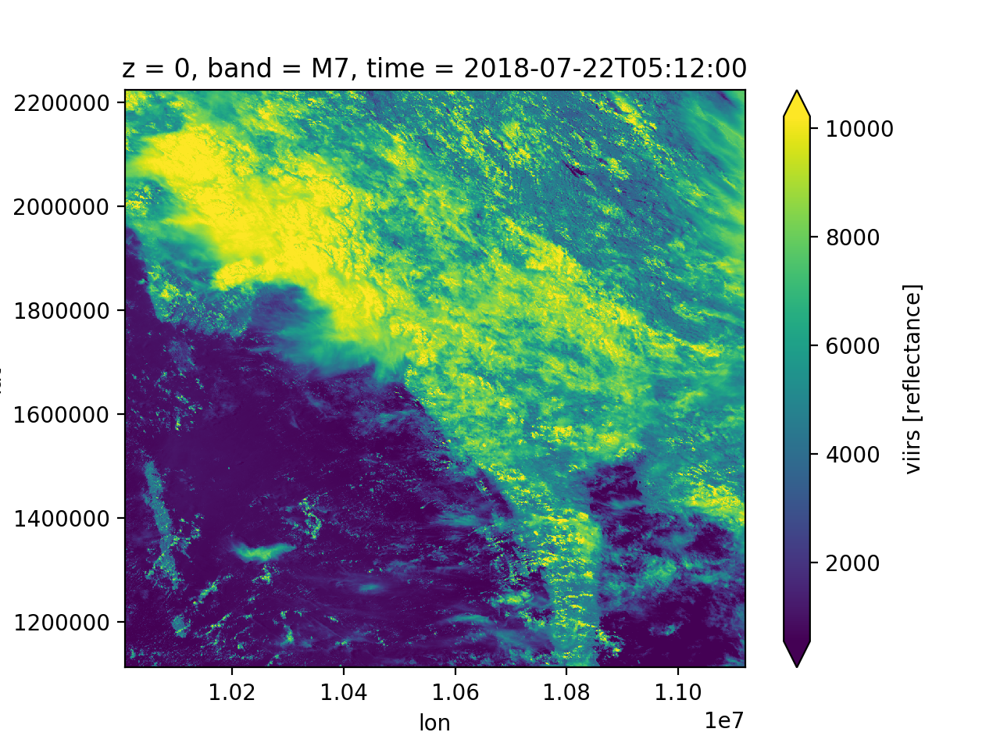

# RasterSmith
RasterSmith is a Python package aimed at making the analysis of satellite remote sensing data products easier.

### Installing RasterSmith
Currently, RasterSmith is under active development. The package is will be hosted on https://test.pypy.org util a stable version is released. To install, you can use pip and direct the index URL to test PyPI:

```
pip install --index-url https://test.pypi.org/simple/ rastersmith
```

<!-- #### Dependencies -->


### Using RasterSmith
Here is a quick example of what you can do with RasterSmith. More detailed on the use of the package is provided in the documentation.

To begin, let's import rastersmith in an IPython environment.

```python
In [1]: import rastersmith as rs
```

The core strength of RasterSmith is the ability to read in geographic raster data and format it in a way that is internally consistent. For example, we will read in a [gridded VIIRS surface reflectance product](https://earthdata.nasa.gov/earth-observation-data/near-real-time/download-nrt-data/viirs-nrt) from NASA LANCE and explore the RasterSmith data structure.

```python
In [2]: viirs = rs.Viirs.read('VNP09GA_NRT.A2018203.h27v07.001.h5')

In [3]: viirs
Out[3]:
<xarray.DataArray 'viirs' (lat: 2400, lon: 2400, z: 1, band: 13, time: 1)>
array([[[[[8373],
          ...,
          [   0]]],


        ...,


        [[[3755],
          ...,
          [   0]]]]], dtype=int16)
Coordinates:
  * z        (z) int64 0
  * lat      (lat) float64 2.223e+06 2.223e+06 2.223e+06 2.222e+06 2.222e+06 ...
  * lon      (lon) float64 1.001e+07 1.001e+07 1.001e+07 1.001e+07 1.001e+07 ...
  * band     (band) <U4 'M1' 'M2' 'M3' 'M4' 'M5' 'M7' 'M8' 'M10' 'M11' 'I1' ...
  * time     (time) datetime64[ns] 2018-07-22T05:12:00
Attributes:
    nativeCrs:     {'init': 'epsg:6974'}
    projStr:       +proj=sinu +R=6371007.181 +nadgrids=@null +wktext
    bandNames:     ('M1', 'M2', 'M3', 'M4', 'M5', 'M7', 'M8', 'M10', 'M11', '...
    extent:        (91.388395, 10.0, 106.42665, 20.0)
    date:          2018-07-22 05:12:00
    units:         % reflectance
    scale_factor:  10000
    add_offset:    0
    resolution:    500
```

As we can see from the data structure, the  viirs variable is an xarray object with five dimensions which are labeled as lat, lon, z, band, and time. RasterSmith uses these five dimensions to account for the full dimensionality of all satellite data products (see [RasterSmith data structure](#rastersmith-data-structure) section for full details). Furthermore, we can see that there are coordinates associated with the dimensions where we can use the internal xarray API for sub-sampling and manipulation.

Now, let's view the imagery:

```python
# Select the moderate resolution NIR band from VIIRS and plot
In [4]: viirs.sel(band='M7').plot(robust=True,cmap='gray')
Out[4]: <matplotlib.collections.QuadMesh at 0x10ea66470>
```


From the resulting output we can see that the gridded VIIRS data was read in with the native sinusoidal projection (even though the coordinate labels lat/lon). RasterSmith uses the WGS84 Geographic Coordinate System (EPSG: 4326) as the internal projection for comparing different raster datasets.

For us now to use the VIIRS data within RasterSmith with other datasets, we must now reproject the data into the WGS84 projection. RasterSmith has a reprojection function to make it easier for users to change between coordinate systems:

```python
# Apply reprojection to VIIRS data
In [5]: viirsProj = rs.mapping.reproject(viirs,outEpsg='4326',outResolution=500)

# Plot the reprojected VIIRS data
In [6]: viirsProj.sel(band='M7').plot(robust=True,cmap='gray
Out[9]: <matplotlib.collections.QuadMesh at 0xd2fd379b0>
```


### Why RasterSmith?
Many satellite data products provided come in different (1) data formats, (2) number of bands, (3) spatial resolution/extent, and (4) geographic projections making the combined use of the data product often difficult to handle and use for non-experts. RasterSmith is used to take the differing data product and make a common format with a set of helper functions for use in analysis.

Take two commonly used remote sensing data products from [LandSat](https://landsat.usgs.gov/) and the [Visible Infrared Imaging Radiometer Suite](https://jointmission.gsfc.nasa.gov/viirs.html) (VIIRS). LandSat is distributed as GeoTIFF files, one file for each band, along with associated metadata in a separate file, where as VIIRS data is distributed as a single HDF5 file with embedded metadata. While individual LandSat GeoTIFF files can be easily used in GIS software, preprocessing is needed to use multiple bands together as a single variable. On the other hand, VIIRS data distributed as HDF5 data is difficult to read in and use within traditional GIS software. Ultimately, using the two datasets in conjunction with ArcGIS or QGIS has proven difficult due to the varying formats that the data is distributed in.

<!-- Furthermore, many satellite data products are provided to users as level-2 swath data (i.e. un-gridded data arrays) with varying levels of geographic information making the use of such data even more difficult to use within a GIS environment. For example, the [Advanced Technology Microwave Sounder](https://jointmission.gsfc.nasa.gov/atms.html) (ATMS) is provided by NOAA as swath data with -->

### RasterSmith data structure
RasterSmith is built upon the [xarray](http://xarray.pydata.org/en/stable/) package<sup>1</sup> and uses the already existing N-D labled array functionality from xarray to assist in harmonizing satellite data products. Thus, the satellite data products read in using RasterSmith adhere to the xarray philosophy with labeled dimensions.


<sup>1</sup> *Technically the core RasterSmith raster class is an [accessor](http://xarray.pydata.org/en/latest/generated/xarray.register_dataset_accessor.html#xarray.register_dataset_accessor) to the xarray DataArray class allowing access to the RasterSmith class methods directly from xarray objects.*
